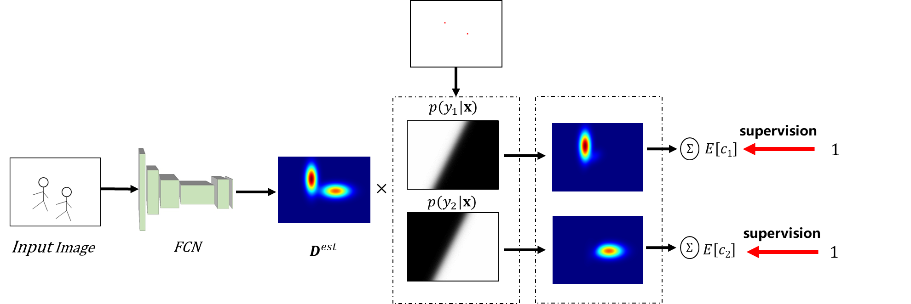
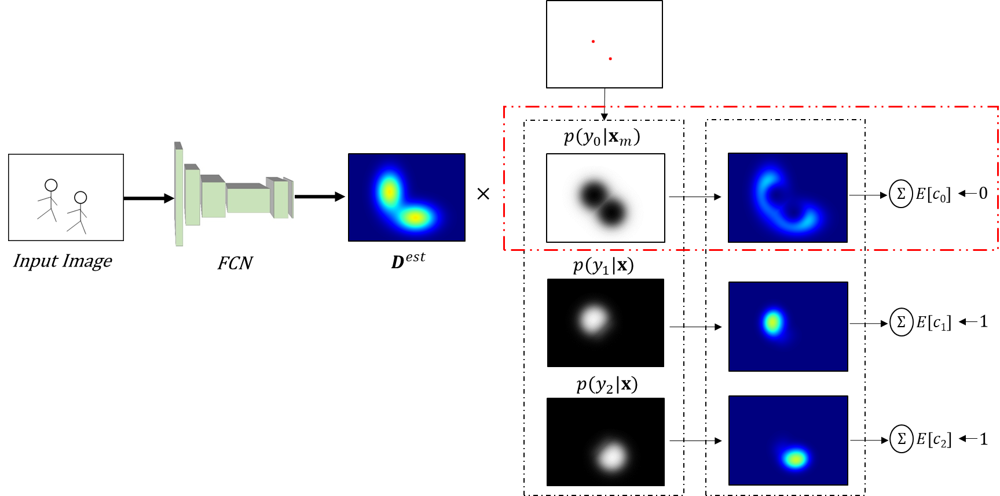
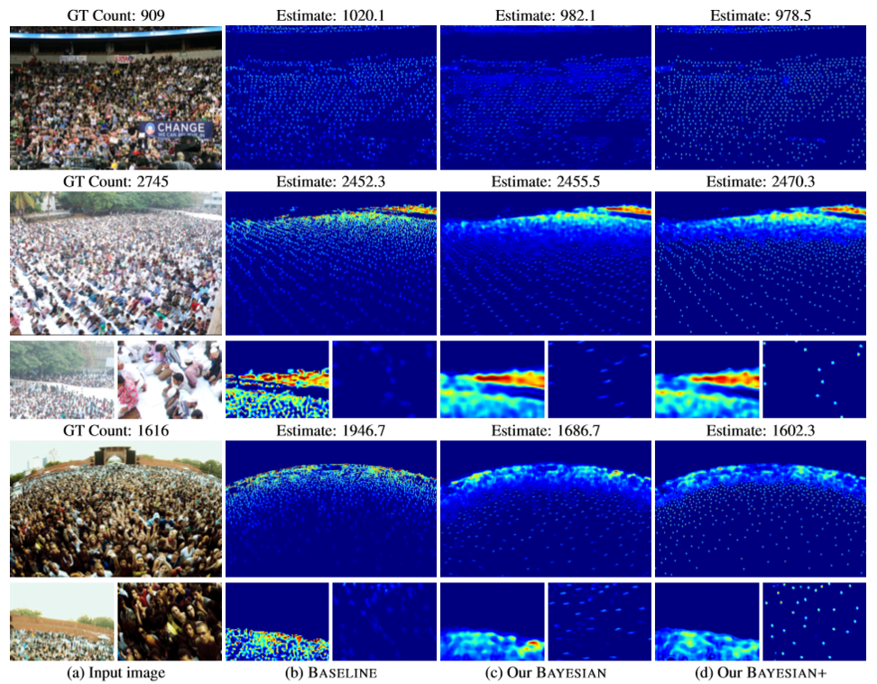

# Bayesian-Crowd-Counting （ICCV 2019 oral）
[Arxiv](https://arxiv.org/abs/1908.03684) | [CVF](http://openaccess.thecvf.com/content_ICCV_2019/papers/Ma_Bayesian_Loss_for_Crowd_Count_Estimation_With_Point_Supervision_ICCV_2019_paper.pdf) 
###  Official Implement of ICCV 2019 oral paper "Bayesian Loss for Crowd Count Estimation with Point Supervision"

## Visualization
### Bayesian



### Bayesian+



### Density



## Citation
If you use this code for your research, please cite our paper:

```
@inproceedings{ma2019bayesian,
  title={Bayesian loss for crowd count estimation with point supervision},
  author={Ma, Zhiheng and Wei, Xing and Hong, Xiaopeng and Gong, Yihong},
  booktitle={Proceedings of the IEEE International Conference on Computer Vision},
  pages={6142--6151},
  year={2019}
}
```

## Code

### Install dependencies

torch >= 1.0 torchvision opencv numpy scipy, all the dependencies can be easily installed by pip or conda

This code was tested with python 3.6  

###  Train and Test

1、 Dowload Dataset UCF-QNRF [Link](https://www.crcv.ucf.edu/data/ucf-qnrf/)

2、 Pre-Process Data (resize image and split train/validation)

```
python preprocess_dataset.py --origin_dir <directory of original data> --data_dir <directory of processed data>
```

3、 Train model (validate on single GTX Titan X)

```
python train.py --data_dir <directory of processed data> --save_dir <directory of log and model>
```

4、 Test Model
```
python test.py --data_dir <directory of processed data> --save_dir <directory of log and model>
```
The result is slightly influenced by the random seed, but fixing the random seed (have to set cuda_benchmark to False) will make training time extrodinary long, so sometimes you can get a slightly worse result than the reported result, but most of time you can get a better result than the reported one. If you find this code is useful, please give us a star and cite our paper, have fun.

5、 Training on ShanghaiTech Dataset

Change dataloader to crowd_sh.py

For shanghaitech a, you should set learning rate to 1e-6, and bg_ratio to 0.1

### Pretrain Weight
#### UCF-QNRF

Baidu Yun [Link](https://pan.baidu.com/s/1Evxxu1skHni3Iv3VxdcZvA) extract code: x9wc

Google Drive [Link](https://drive.google.com/file/d/1i22E7_zigkSm7nBnqMaEv00MD3CPhIDk/view?usp=sharing)

#### ShanghaiTech A

Baidu Yun [Link](https://pan.baidu.com/s/1GlaxGzFI8qFCHbqu56qSRw) extract code: tx0m

Goodle Drive [Link](https://drive.google.com/file/d/13bEdshBY-brUvLSwTCOqDlK5QKcZIAAH/view?usp=sharing)

#### ShanghaiTech B

Baidu Yun [Link](https://pan.baidu.com/s/1YYg-a-sdhBAHZRJzZOU-6Q) extract code: a15u

Goodle Drive [Link](https://drive.google.com/file/d/1woK-bI_JyeY9wZL2pXsWgPzQqhD8Qy0u/view?usp=sharing)

### License

GNU GENERAL PUBLIC LICENSE 
Version 3, 29 June 2007
Copyright © 2007 Free Software Foundation, Inc. <http://fsf.org/>

